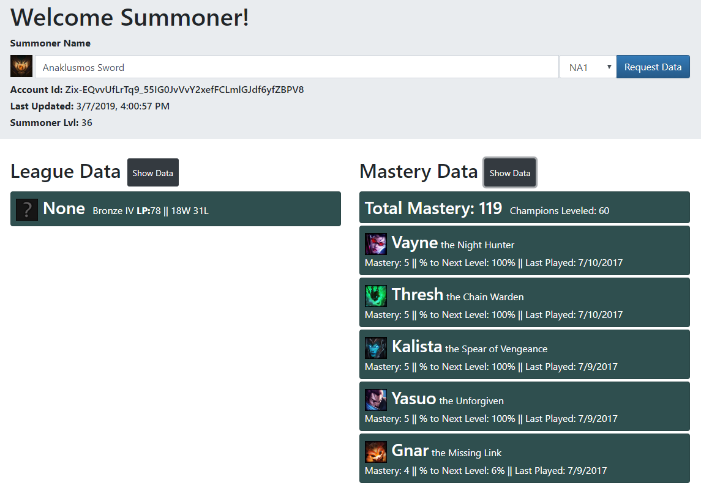
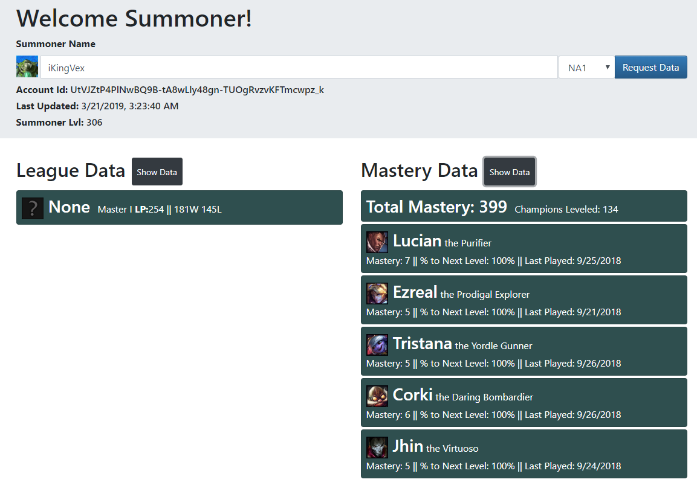

# Summoner Information Display Tool
Currently the tool is inactive due to using a temporary developer API code for local testing. Were I to make this tool available online I would need to submit a proposal through official Riot Games channels, and it would most likely be denied due to its small scope. Additionally, due to the CORS-enabled server that Riot uses, even testing this website without a proper developer API code required disabling browser web security, which was a blast. 

Ultimately this project was quite enjoyable and introduced/got me familiar with some ES6 concepts like promises and the new fetch API which are both interesting. It was also my first proper integration of a 3rd Party API in one of my projects, so that was a satisfying milestone. 

---
## Screenshots
**Summoner ID:** Anaklusmos Sword (me)  
  
**Summoner ID:** iKingVex
  
---
*Legal Blurb*  
**SIDT isn’t endorsed by Riot Games and doesn’t reflect the views or opinions of Riot Games
or anyone officially involved in producing or managing League of Legends. League of Legends and Riot Games are
trademarks or registered trademarks of Riot Games, Inc. League of Legends © Riot Games, Inc.**
